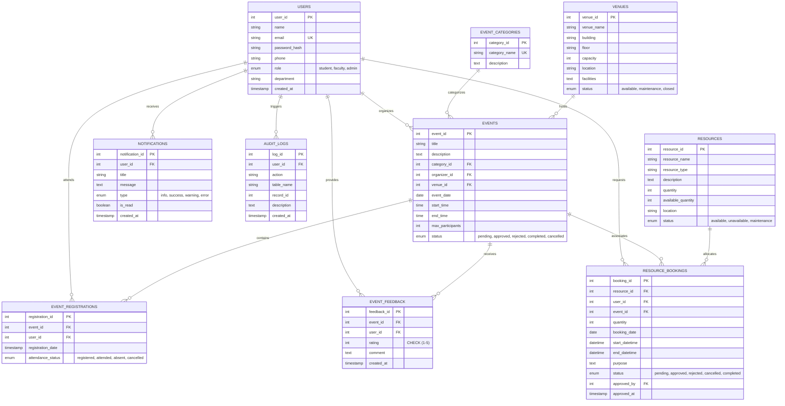

# 🎓 CAMPUS HUB
### Campus Event & Resource Booking System (DBMS Project)

> **"One Platform for Campus Events & Resources"**  
> A production-grade, full-stack college DBMS web application built with **React, Node.js, Express, and MySQL 8+**.

---

## 📌 1. Project Overview & Problem Statement

College campuses organize hundreds of technical symposia, cultural festivals, sports tournaments, and workshops each semester. Simultaneously, clubs and departments require access to shared resources such as auditoriums, seminar halls, high-end laptops, DSLR cameras, wireless PA systems, and projectors.

Traditional management suffers from:
1. **Double-booking conflicts** for venues and high-demand equipment.
2. **Lack of transparency** regarding registration limits and available seats.
3. **Disconnected spreadsheets** that fail to enforce relational constraints or maintain audit logs.
4. **Poor role segregation** between students, faculty organizers, and campus administrators.

**Campus Hub** solves this through a normalized relational database engine that enforces real-time capacity checks, booking collision prevention, automated notifications, role-based workflows, and analytics reporting.

---

## 🏗️ 2. Technology Stack

- **Frontend:** React 18 (Vite), Tailwind CSS, Lucide React icons, Recharts (visual data analytics), React Router v6, React Hot Toast
- **Backend:** Node.js, Express.js (REST APIs, modular controller-service architecture)
- **Database:** MySQL 8+ (InnoDB engine, utf8mb4, parameterized queries, stored procedures, triggers, views, transactions)
- **Authentication & Security:** JWT (JSON Web Tokens), bcryptjs password hashing (10 salt rounds), RBAC (Role-Based Access Control)

---

## 👥 3. User Roles & Permission Matrix

| Feature / Action | 👨‍🎓 Student | 🧑‍🏫 Faculty | 👑 Administrator |
|---|:---:|:---:|:---:|
| Register / Login / JWT Profile | ✅ | ✅ | ✅ |
| Browse Approved Events | ✅ | ✅ | ✅ |
| Register for Events & Cancel Registrations | ✅ | ✅ | ✅ |
| Submit Event Proposals | ❌ | ✅ | ✅ (Auto-Approved) |
| Manage / Edit Owned Events | ❌ | ✅ | ✅ |
| Approve / Reject Event Proposals | ❌ | ❌ | ✅ |
| Browse Campus Resource Inventory | ✅ | ✅ | ✅ |
| Submit Resource Booking Request | ✅ | ✅ | ✅ |
| Approve / Reject Resource Bookings | ❌ | ❌ | ✅ |
| Venue & Category Management (CRUD) | ❌ | ❌ | ✅ |
| User Management (Students / Faculty) | ❌ | ❌ | ✅ |
| System Reports & CSV Analytics Export | ❌ | ❌ | ✅ |
| Database Audit Logs Inspection | ❌ | ❌ | ✅ |
| In-App Notification Center | ✅ | ✅ | ✅ |

---

## 📊 4. Database Architecture & ER Diagram

The database follows a **Third Normal Form (3NF)** relational design with 10 tables, eliminating data redundancy and ensuring referential integrity via Foreign Key cascading and restrict rules.



---

## 💡 5. Key DBMS Concepts Demonstrated

1. **Primary & Foreign Key Constraints:** Established across all 10 tables with explicit `ON DELETE CASCADE`, `ON DELETE SET NULL`, and `ON DELETE RESTRICT` actions to preserve referential integrity.
2. **Candidate & Unique Keys:**
   - `users.email` (UNIQUE)
   - `event_categories.category_name` (UNIQUE)
   - Composite `UNIQUE KEY (event_id, user_id)` on `event_registrations` (prevents double registrations).
   - Composite `UNIQUE KEY (event_id, user_id)` on `event_feedback` (prevents duplicate ratings).
3. **CHECK Constraints:**
   - `chk_venue_capacity`: `capacity > 0`
   - `chk_event_participants`: `max_participants > 0`
   - `chk_event_time`: `end_time > start_time`
   - `chk_resource_quantity`: `quantity >= 0` and `available_quantity >= 0`
   - `chk_feedback_rating`: `rating BETWEEN 1 AND 5`
4. **Database Views:**
   - `approved_events_view`: Joins events, categories, organizers, and venues with calculated subqueries for live remaining seats.
   - `available_resources_view`: Calculates real-time available stock vs active bookings.
   - `event_registration_summary`: Aggregates attendee statistics, attendance status, and average star ratings (`GROUP BY`, `COUNT`, `AVG`).
   - `resource_booking_summary`: Summarizes equipment demand across pending, approved, and rejected allocations.
5. **Stored Procedures & ACID Transactions:**
   - `register_for_event()`: Uses `START TRANSACTION`, `SELECT ... FOR UPDATE` (row lock), capacity checking, registration insertion, and `COMMIT`/`ROLLBACK`.
   - `book_resource()`: Validates available inventory and detects date/time slot collisions before recording requests.
   - `approve_resource_booking()`: Atomic transaction updating booking status and decrementing resource inventory.
   - `get_event_statistics()`: Multi-metric analytics procedure using `GROUP BY`, `HAVING`, and date range filters.
6. **Database Triggers:**
   - `trg_after_booking_approve`: Automatically decrements `available_quantity` upon booking approval and restores stock upon cancellation or completion.
   - `trg_before_resource_update`: Prevents inventory quantity from falling below zero.
   - `trg_after_event_status_change`: Automatically generates targeted notifications when events are approved, rejected, or cancelled.
   - `trg_audit_event_changes`: Writes immutable audit logs whenever event lifecycles transition.
7. **Indexing:**
   - B-Tree indexes created on search and filter columns (`email`, `role`, `event_date`, `status`, `resource_type`, `department`).

---

## 🚀 6. Installation & Setup Guide

### Prerequisites
- **Node.js** (v18 or higher)
- **MySQL Server 8+** (running locally on port 3306)

---

### Step 1: Clone or Navigate to Project
```bash
cd "c:/Users/ruchi/OneDrive/Pictures/Attachments/Desktop/CAMPUS EVENT & RESOURCE BOOKING SYSTEM"
```

---

### Step 2: Database Initialization

Open MySQL Workbench, phpMyAdmin, or MySQL CLI:

```sql
-- 1. Create database and tables
SOURCE database/schema.sql;

-- 2. Populate sample dataset
SOURCE database/seed.sql;
```

*(Alternatively, configure `backend/.env` with your MySQL credentials and run `npm run seed` inside the `backend` directory).*

---

### Step 3: Backend Configuration & Startup

1. Open `backend/.env` and update your MySQL password:
   ```env
   PORT=5000
   DB_HOST=localhost
   DB_PORT=3306
   DB_USER=root
   DB_PASSWORD=your_mysql_password
   DB_NAME=campus_hub
   JWT_SECRET=campus_hub_jwt_secret_key_2024_change_in_production
   JWT_EXPIRES_IN=7d
   FRONTEND_URL=http://localhost:5173
   ```
2. Start backend server:
   ```bash
   cd backend
   npm start
   ```
   *The backend will run on `http://localhost:5000`.*

---

### Step 4: Frontend Startup

1. Open a new terminal:
   ```bash
   cd frontend
   npm run dev
   ```
2. Open your browser and visit:  
   👉 **`http://localhost:5173`**

---

## 🔑 7. Demo Accounts & Credentials

All demo accounts share the password: **`Demo@123`**

| Role | Email | Password | Access Capabilities |
|---|---|---|---|
| **Admin** | `admin@campushub.com` | `Demo@123` | Full dashboard, approvals, venues, users, categories, reports, audit logs |
| **Faculty** | `faculty@campushub.com` | `Demo@123` | Event proposal submission, event attendee tracking, equipment booking |
| **Student** | `student@campushub.com` | `Demo@123` | Browse events, one-click registration, review feedback, resource requests |

*(Quick-login buttons for Admin, Faculty, and Student are provided directly on the Login page).*

---

## 📡 8. REST API Documentation Summary

### Auth APIs (`/api/auth`)
- `POST /api/auth/register` - Student registration with bcrypt hashing
- `POST /api/auth/login` - Authenticate user and return JWT
- `GET /api/auth/profile` - Get logged-in user profile [Protected]
- `PUT /api/auth/profile` - Update user details [Protected]

### Events APIs (`/api/events`)
- `GET /api/events` - Filter events by category, venue, date, search, sort
- `GET /api/events/:id` - Detailed event info + user registration state
- `POST /api/events` - Create event / proposal [Faculty/Admin]
- `PUT /api/events/:id` - Update event details [Faculty/Admin]
- `PUT /api/events/:id/status` - Approve, reject, or cancel event [Admin]
- `DELETE /api/events/:id` - Delete event [Faculty/Admin]

### Registrations APIs (`/api/registrations`)
- `POST /api/registrations/:eventId` - Register for an event (transaction-safe)
- `DELETE /api/registrations/:eventId` - Cancel registration
- `GET /api/registrations/my` - User's registered event history
- `GET /api/registrations/event/:eventId` - Attendee list [Organizer/Admin]

### Resources & Bookings (`/api/resources`, `/api/bookings`)
- `GET /api/resources` - Browse inventory with live availability counts
- `POST /api/resources` - Add new resource [Admin]
- `POST /api/bookings` - Submit equipment reservation request
- `GET /api/bookings` - View bookings (role-filtered)
- `PUT /api/bookings/:id/approve` - Approve booking request [Admin]
- `PUT /api/bookings/:id/reject` - Reject booking request [Admin]
- `PUT /api/bookings/:id/cancel` - Cancel booking request

### Admin & Analytics (`/api/venues`, `/api/categories`, `/api/users`, `/api/reports`, `/api/audit`)
- `GET /api/dashboard` - Role-customized statistics & charts
- `GET /api/reports?report_type=...` - 8 aggregate analytical reports
- `GET /api/audit` - Audit log viewer
- `GET /api/venues`, `GET /api/categories`, `GET /api/users` - Full CRUD management

---

## 🏆 9. Academic Demonstration & Viva Points

1. **Why MySQL over NoSQL (MongoDB) for this system?**
   - ACID transactions are essential to prevent double-booking of venues and overbooking of limited physical resources.
   - Relational foreign keys and composite unique constraints guarantee data integrity at the database layer.
2. **How is venue collision prevented?**
   - The system executes overlapping time queries (`start_time < new_end AND end_time > new_start`) across approved and pending bookings for the same date and venue before insertion.
3. **How does inventory synchronization work?**
   - Automated MySQL triggers (`trg_after_booking_approve`) monitor the `resource_bookings` table and decrement/increment `available_quantity` in `resources` atomically.
4. **How is security handled?**
   - All SQL queries use parameterized placeholders (`?`) preventing SQL Injection.
   - Passwords are encrypted with bcrypt (10 rounds).
   - Sensitive fields (`password_hash`) are omitted from API responses.
